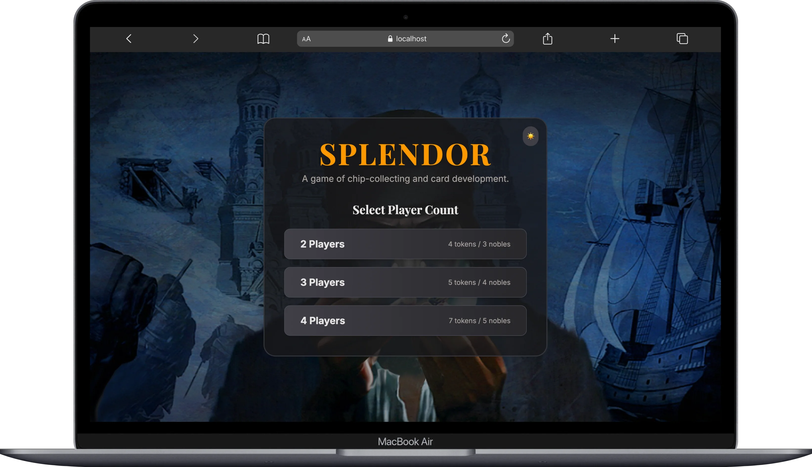
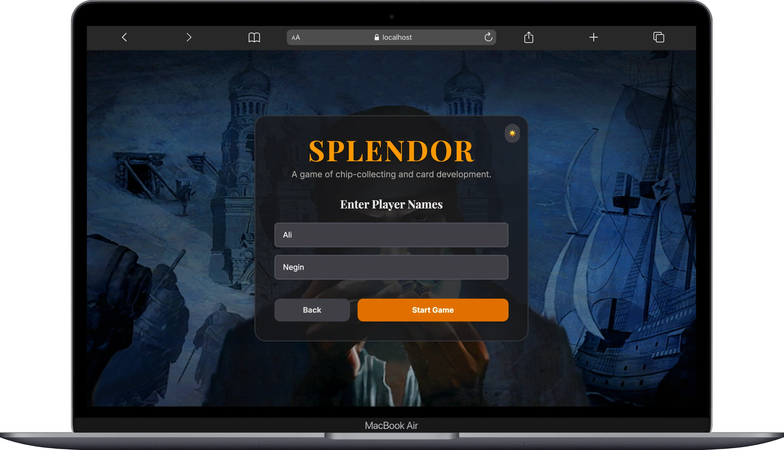
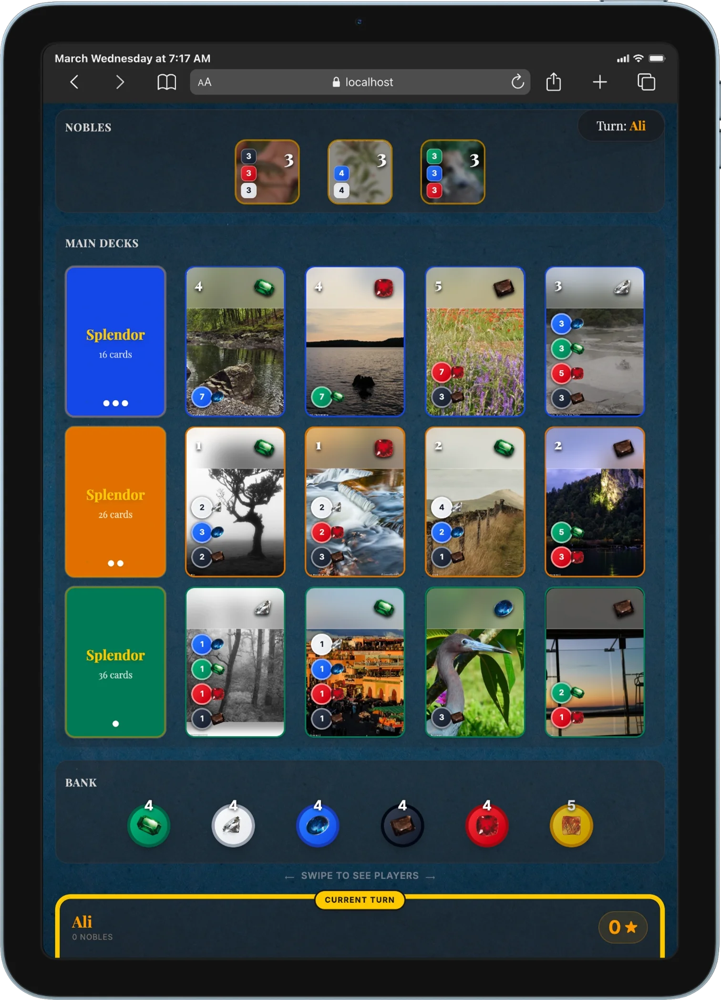
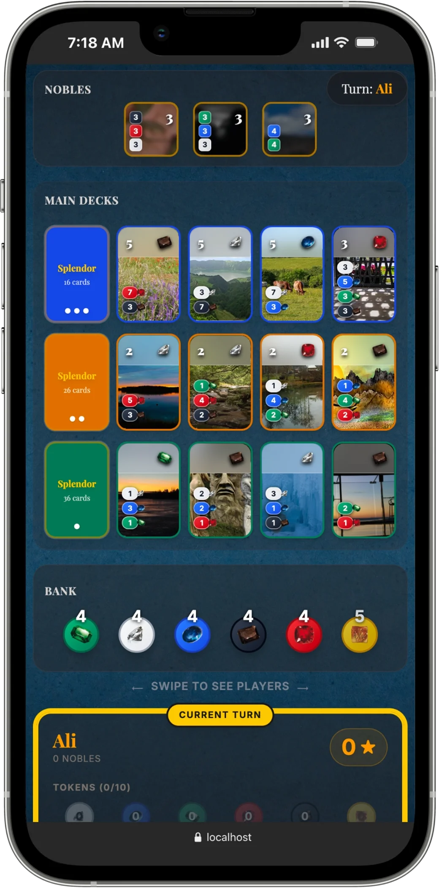

# Splendor App (Client-only)


A modern React + TypeScript implementation of **Splendor** (board game) built with **Vite**.

## About

- **Players**: 2–4
- **Mode**: Offline, local (hot-seat)
- **Roadmap**: Online multiplayer planned for the future

## Board game reference

- [Splendor on BoardGameGeek](https://boardgamegeek.com/boardgame/148228/splendor)

## Screenshots

All screenshots live in `./docs/screenshots/`.

### Desktop (startup)





### Desktop (in game)


### Tablet



### Mobile



## Tech Stack

- React
- TypeScript
- Vite
- Tailwind CSS
- Framer Motion

## Project structure

- `src/App.tsx`: Main UI + turn flow + modals
- `src/components/*`: UI components (board, cards, tokens, dashboards, modals)
- `src/game/*`: Game rules/state (setup, actions, models, data)
- `public/images/*`: Background images used in UI

## Game rules (quick)

- **Win condition**: Reach **15 Prestige Points**. After someone reaches 15, the round finishes so everyone has equal turns; highest score wins (tiebreaker: fewer purchased cards).
- **One action per turn**:
  - Take **3 different** gem tokens
  - Take **2 same-color** tokens (only if that color has **≥ 4** in the bank)
  - **Reserve** a card (board or top of a deck) and take **1 Gold Joker** if available (max 3 reserved)
  - **Purchase** a card (from board or reserved), using tokens + permanent bonuses (Gold can cover missing cost)
- **Token limit**: If you end your action with more than **10 tokens**, you must discard down to 10.
- **Nobles**: At end of turn, if your permanent bonuses satisfy a noble, it visits you (worth 3 points). If multiple nobles are eligible, you choose one.

## Local Development

### Prerequisites

- Node.js (LTS recommended)

### Environment variables

No environment variables are required to run the client.

### Install

```bash
npm install
```

### Run

```bash
npm run dev
```

This starts Vite on:

- **URL**: `http://localhost:3000`
- **Host binding**: `0.0.0.0` (useful for LAN/mobile testing)

### Build

```bash
npm run build
```

### Preview production build

```bash
npm run preview
```

### Typecheck (lint)

```bash
npm run lint
```

### Clean build output

```bash
npm run clean
```

## Deployment

This is a standard Vite app; you can deploy it to services like Vercel, Netlify, or GitHub Pages.

## License

MIT. See [`LICENSE`](LICENSE).

